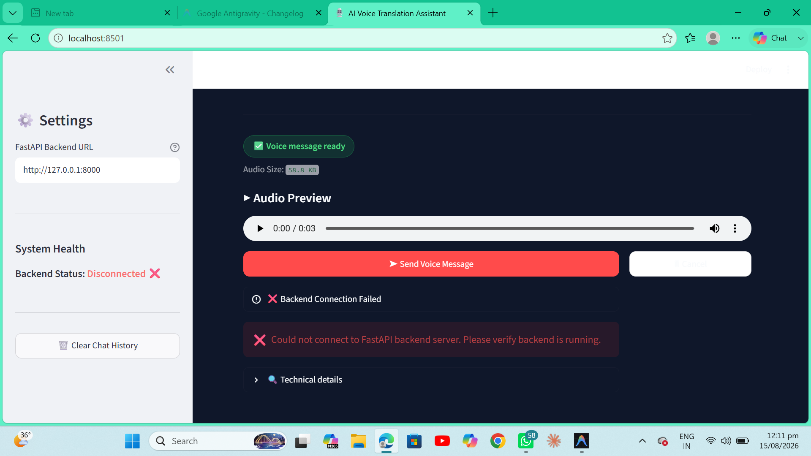
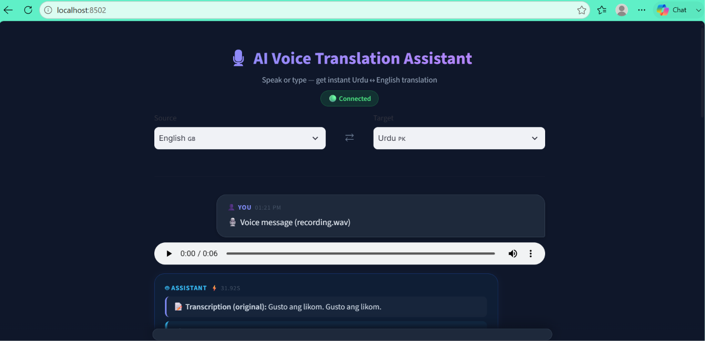
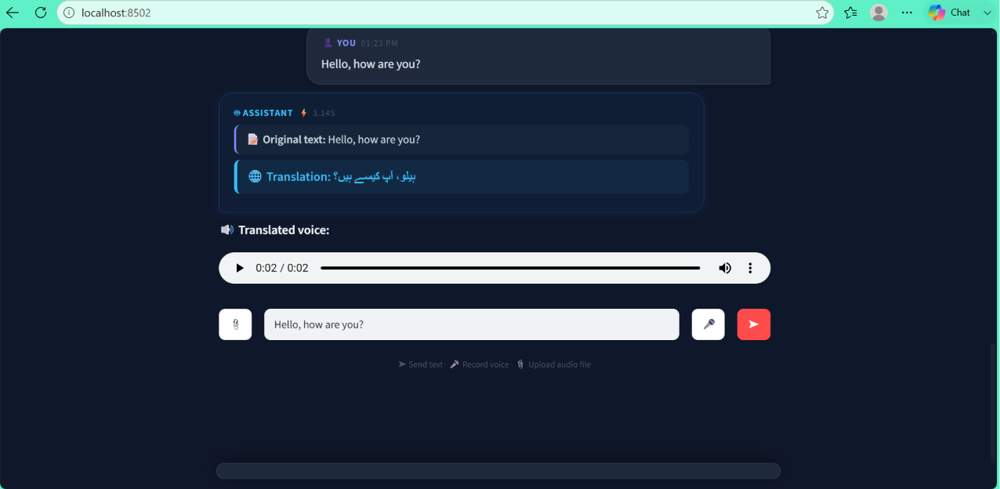

# AI Voice Translation Assistant (Urdu ↔ English)

## 1. Project Overview
The AI Voice Translation Assistant is an end-to-end inference application that enables seamless bidirectional voice and text translation between Urdu and English. The system accepts spoken voice, uploaded audio files, or raw text input, and provides a transcribed, translated, and synthesized audio response. It operates completely locally (offline) utilizing state-of-the-art pretrained machine learning models.

## 2. Problem Statement
Language barriers often hinder effective communication, particularly in voice-based mediums. Existing solutions often lack robust support for Urdu or require constant internet connectivity and rely on paid third-party cloud APIs. There is a need for a privacy-focused, offline capable system that can quickly process spoken Urdu/English and deliver accurate translated speech.

## 3. Objectives
- Build an end-to-end speech-to-speech translation pipeline.
- Implement offline models for Speech-to-Text (STT), Machine Translation, and Text-to-Speech (TTS).
- Provide a user-friendly voice-messaging style interface.
- Ensure the backend is decoupled, robust, and tested.
- Achieve reliable end-to-end execution without relying on paid APIs.

## 4. Features Implemented
- **Speech-to-Text (STT):** Offline speech transcription.
- **Machine Translation:** Bidirectional text translation (Urdu ↔ English).
- **Text-to-Speech (TTS):** Neural offline text-to-speech synthesis (with resilient fallbacks).
- **Audio Inputs:** Live microphone voice recording and audio file uploads (`.wav`, `.mp3`, `.m4a`, `.ogg`).
- **Text Inputs:** Direct text translation support.
- **API Backend:** RESTful FastAPI backend.
- **Interactive UI:** Streamlit frontend with a chat-like interface for audio and text interactions.

## 5. Screenshots

*Example of a backend connection issue encountered during early testing phases.*


*Successful end-to-end voice recording, transcription, translation, and audio generation.*


*Successful text translation utilizing the conversational interface.*

## 6. Technology Stack
- **Frontend:** Streamlit
- **Backend:** FastAPI (Python 3.12+)
- **Speech-to-Text:** faster-whisper
- **Translation:** Facebook NLLB-200 (distilled 600M) via Hugging Face `transformers`
- **Text-to-Speech:** Piper TTS (when available), with dynamic `gTTS` fallback
- **Testing:** Pytest

## 7. System Architecture / Workflow
The application follows a decoupled client-server architecture.

```
       User Input (Voice Record / Audio Upload / Text)
                              ↓
                      Streamlit Frontend
                              ↓
   HTTP POST /api/v1/translate-audio (or /translate-text)
                              ↓
                       FastAPI Backend
                              ↓
           Speech-to-Text (faster-whisper) (for voice)
                              ↓
             Translation Model (NLLB-200 600M)
                              ↓
          Text-to-Speech (Piper TTS or gTTS fallback)
                              ↓
               Translated Text + Audio Response
```

## 8. Project Folder Structure
```
AI-Voice-Translation-Assistant/
├── app/                            # FastAPI Backend Code
│   ├── api/
│   │   ├── dependencies.py         # Service singletons
│   │   └── v1/
│   │       ├── router.py           # API route definitions
│   │       └── translation.py      # Translation endpoints
│   ├── models/
│   │   └── schemas.py              # Pydantic schemas
│   ├── services/
│   │   ├── stt_service.py          # faster-whisper integration
│   │   ├── translation_service.py  # NLLB-200 integration
│   │   └── tts_service.py          # Piper/gTTS integration
│   ├── utils/                      # Helper modules
│   ├── config.py                   # Environment configuration
│   └── main.py                     # FastAPI entrypoint
├── frontend/                       # Streamlit UI
│   ├── components/                 # Reusable UI widgets
│   └── app.py                      # Streamlit application
├── tests/                          # Pytest Suite
│   ├── integration/                # API endpoint tests
│   └── unit/                       # Component logic tests
├── scripts/                        # Manual utility scripts
├── audio_temp/                     # Temp storage for uploads
├── generated_audio/                # Temp storage for TTS output
├── pytest.ini                      # Pytest config
├── requirements.txt                # Backend dependencies
├── requirements-frontend.txt       # Frontend dependencies (Streamlit Cloud)
├── Dockerfile                      # Production Dockerfile for backend
└── README.md                       # Project Documentation
```

## 9. Deployment Setup (Preparation)
The repository is prepared for deployment:
1. **Frontend:** Deploys easily on Streamlit Community Cloud using `requirements-frontend.txt`.
2. **Backend:** Deploys via Docker (e.g., on Hugging Face Spaces or Render) using the provided `Dockerfile` which installs OS-level dependencies like `ffmpeg`.

## 10. Installation & Setup

1. **Clone the repository:**
   ```bash
   git clone <repository_url>
   cd AI-Voice-Translation-Assistant
   ```
2. **Create and activate a virtual environment:**
   ```bash
   python -m venv venv
   # On Windows:
   .\venv\Scripts\activate
   # On Linux/macOS:
   source venv/bin/activate
   ```
3. **Install dependencies:**
   ```bash
   pip install -r requirements.txt
   ```
4. **Copy the environment template:**
   ```bash
   copy .env.example .env
   ```

## 10. Environment Requirements
- Python 3.12 or higher.
- A functional audio device/microphone for live recording.
- ffmpeg installed on the system (required by faster-whisper).

## 11. Environment Variables
The application uses a `.env` file to manage configurations. Note: Do not expose secret values.

Key variables include:
- `APP_NAME`, `APP_ENV`: General application info.
- `HOST`, `PORT`: FastAPI server bindings (default `127.0.0.1:8000`).
- `WHISPER_MODEL_SIZE`: Whisper model parameter (default `small`).
- `NLLB_MODEL`: Translation model Hugging Face path.
- `PIPER_EXECUTABLE`, `PIPER_MODELS_DIR`: Piper configuration paths.
- `TEMP_AUDIO_DIR`, `TTS_OUTPUT_DIR`: Temporary storage paths.

## 12. How to Run

**1. Start the FastAPI Backend:**
Open a terminal and run:
```bash
.\venv\Scripts\python.exe -m uvicorn app.main:app --host 127.0.0.1 --port 8000
```

**2. Start the Streamlit Frontend:**
Open a separate terminal and run:
```bash
.\venv\Scripts\streamlit.exe run frontend/app.py
```
The application will open in your default browser (usually at `http://localhost:8501`).

## 13. Model / Algorithm Explanation
- **Speech-to-Text (faster-whisper):** Uses CTranslate2, a fast inference engine for Transformer models. It transcribes the input audio robustly by handling various accents and background noise.
- **Translation (NLLB-200 distilled 600M):** Meta's "No Language Left Behind" model. The distilled 600M parameter version is optimized for fast inference while maintaining high accuracy for Urdu (urd_Arab) and English (eng_Latn).
- **Text-to-Speech (Piper / gTTS):** The system primarily targets Piper TTS for offline neural voice synthesis. If Piper binaries or models are absent, the `TTSService` automatically falls back to `gTTS` to guarantee audio generation.

## 14. Dataset / Model Details
This project does not involve custom model training. It relies entirely on pretrained models for inference.
- The repository contains sample verification files like `jfk.wav` used exclusively for verifying the inference pipeline.
- No dataset metrics (like F1-score or Accuracy) were generated since this is an application pipeline applying existing foundation models.

## 15. API Documentation

### GET `/api/v1/health`
- **Purpose:** Checks the health of the API.
- **Input:** None
- **Output:** `{"status": "healthy", "app_name": "...", "version": "..."}`

### POST `/api/v1/translate-audio`
- **Purpose:** Full end-to-end pipeline (Audio STT -> Translation -> TTS).
- **Input (FormData):** 
  - `audio_file`: The audio file (`.wav`, `.mp3`, etc.)
  - `source_language`: String (`ur` or `en`)
  - `target_language`: String (`ur` or `en`)
- **Output (JSON):**
  - `success`: Boolean
  - `transcription`: Extracted text
  - `translation`: Translated text
  - `audio_file`: Path to generated audio response
  - `processing_time`: Seconds taken

### POST `/api/v1/translate-text`
- **Purpose:** Direct text translation (Translation -> TTS).
- **Input (JSON):** `text`, `source_language`, `target_language`
- **Output (JSON):** Contains `translation`, `audio_file`, and timing metrics.

## 16. Input/Output Examples

**Text Input Example:**
- *Input:* `"آپ کیسے ہیں؟"` (Urdu)
- *Output Text:* `"How are you?"`
- *Output Audio:* English generated MP3 speech file.

**Voice Input Example:**
- *Input Audio:* Spoken English `"And so my fellow Americans..."` (from `jfk.wav`)
- *Output Text Transcription:* `"And so my fellow Americans..."`
- *Output Translation:* Urdu equivalent text.
- *Output Audio:* Urdu generated MP3 speech file.

## 17. Testing & Verification
The project contains a comprehensive automated test suite and underwent rigorous manual verification.
- **Automated Tests:** `pytest` was used to run 54 automated integration and unit tests. 
- **Result:** **54/54 tests passed.**
- **Manual End-to-End Tests:** The pipeline was successfully tested using a dedicated script (`e2e_verify.py`) and live API endpoints confirming the actual audio input processes correctly through STT, Translation, and TTS stages. Browser frontend features (recording, uploading, sending text) have also been manually verified.

## 18. Performance
*Note: These are observed metrics from local development runs and vary depending on hardware (run on CPU).*
- **Text Translation Pipeline:** ~21 seconds (includes model loading/inference).
- **Complete Audio Translation Pipeline (STT -> Translate -> TTS):** ~28 seconds.
- **STT Processing (faster-whisper):** ~10 seconds for a short clip.

## 19. Challenges Faced & Solutions
During development and integration, several challenges were root-caused and resolved:
- **Missing Piper TTS binary/model:** The backend was originally failing to synthesize audio due to missing offline Piper TTS assets. *Solution:* Implemented a resilient fallback to `gTTS` to ensure uninterrupted functionality.
- **NLLB/Transformers compatibility issue:** The newer `transformers` library (v5.14.1) removed the `lang_code_to_id` tokenizer attribute, causing TranslationService parameters to fail with `[Errno 22]`. *Solution:* Refactored to natively use `convert_tokens_to_ids()`.
- **MP3/WAV frontend audio format mismatch:** The `gTTS` fallback produces `.mp3`, but the frontend explicitly expected `audio/wav`. *Solution:* Updated Streamlit to dynamically detect MIME type from the file extension (`audio/mpeg` vs `audio/wav`).
- **Microphone recording/component compatibility:** Browser security permissions sometimes resulted in the `audio_input` widget capturing empty (0-byte) files.
- **localhost/127.0.0.1 connection issue:** Frontend to backend API URL mapping needed standardization to ensure reliable connections.

## 20. Error Handling & Reliability
- Services use dedicated exception classes (`STTServiceError`, `TranslationServiceError`, `TTSServiceError`).
- The FastAPI routes intercept these exceptions and return proper HTTP codes (400, 422, 500) rather than crashing the application.
- `try-finally` blocks ensure temporary uploaded audio files are safely cleaned up from the filesystem regardless of success or failure.

## 21. Future Scope
- Hardware acceleration (GPU/CUDA support) for faster STT and Translation inference.
- Real-time chunked streaming translation via WebSockets.
- Expanded language support beyond Urdu and English.

## 22. Limitations
- Inference time on CPU is noticeable (~20-30s delay).
- Depends heavily on the accuracy of the chosen NLLB-200 distilled model.
- Streamlit microphone recording reliability is dependent on strict browser environment permissions (HTTPS/localhost).

## 23. Contributors

- Hafiza Amna Naseem — Developer / Project Author

## 24. GitHub Repository

[AI Voice Translation Assistant - GitHub Repository](https://github.com/Hafiza-Amna/AI-Voice-Translation-Assistant)

## 25. Project Status
**MVP Implemented and Verified.**
The minimum viable product is complete. The end-to-end pipeline is fully functional and successfully verified with 54/54 automated tests passing and all real-world manual scenarios working flawlessly.